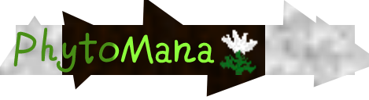

#Phytomana

*Phytomana* is an API mod for **SurvivalCraft2**, inspired by the design philosophies of *Botania* from **Minecraft**.

---

#Overview

**Phytomana** aims to bring *nature-driven* *magical* *automation* and *utility systems* to **SurvivalCraft2**, providing a flexible foundation for both mod developers and players who seek a more organic approach to tech and magic progression.

---

#**License**

This project is distributed under a dual-license structure:

##Code License

All source code is licensed under the **Mozilla Public** License 2.0 (MPL-2.0).

>You may use, modify, and distribute the code, provided that any modifications to MPL-licensed files are made available under the same license. For full terms, see MPL-2.0.

##Asset License

All textures and graphical assets are licensed under the **Creative Commons Attribution-NonCommercial 3.0** Unported (CC BY-NC 3.0).

>This means you are free to share and adapt the assets, but you must give appropriate credit, and you may not use them for commercial purposes.

Asset Credit: **WuroZaye** (and other contributors, as listed in metadata).

***Note***: *Additional assets may be added in future updates, and credit maybe will be not updated accordingly.*

---

#Mod Template License

The original mod template used to bootstrap this project is provided under the MIT License.
See **LICENSE.template** for full text.

---

License Badges

---

#Legal Notices

>· MPL-2.0 license text is included in the repository.
>· CC BY-NC 3.0 license text is **not** included in the repository.
>· The MIT-licensed template is retained under LICENSE.template for reference.

---